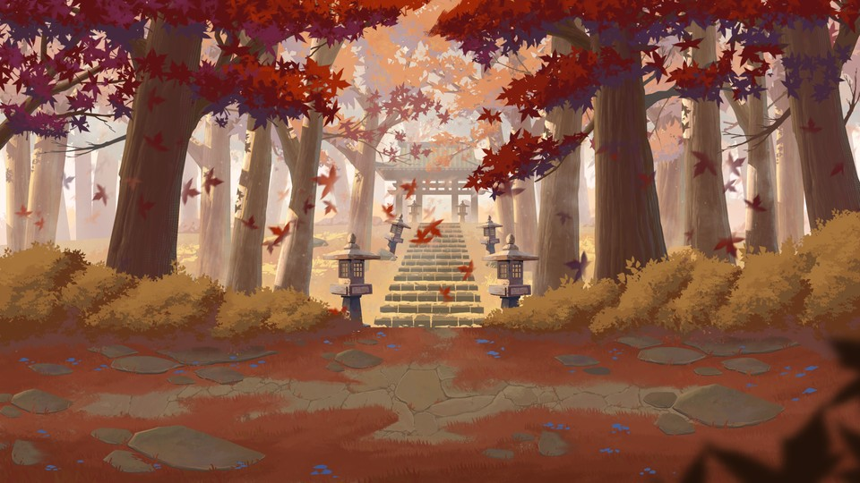
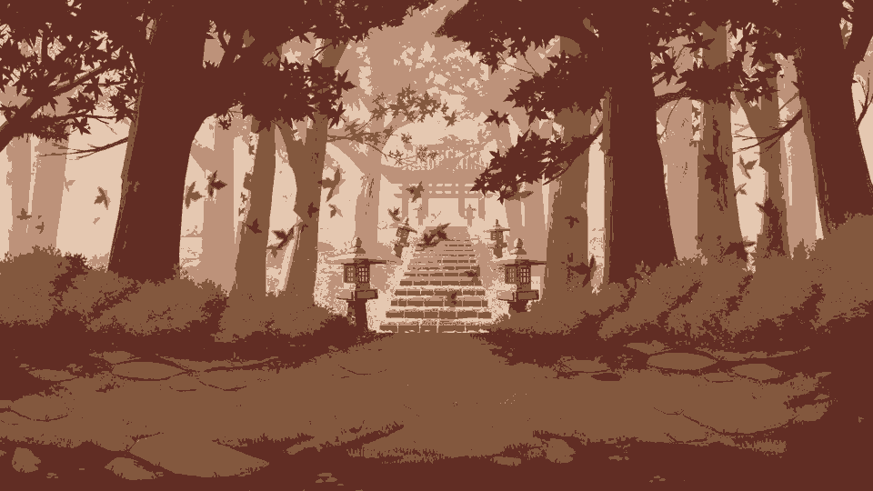
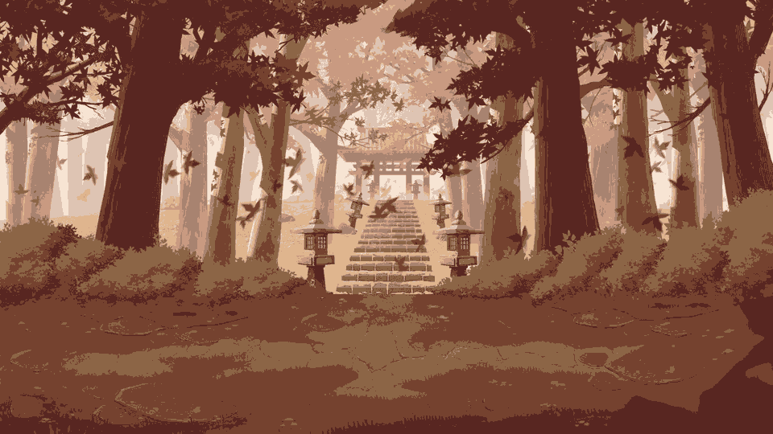

# color-quantizer

A command-line tool that reduces an image to **k colors** using **k-means clustering implemented from scratch** in NumPy. It uses no scikit-learn, SciPy clustering or other ML libraries; Pillow is used only to read and write image files.

## Example

| Original (96,085 colors) | k = 4 | k = 8 |
| :---: | :---: | :---: |
|  |  |  |
| |  |  |

With **k = 4** the scene is reduced to four browns, from dark trunks to light sky, giving a flat poster look.
With **k = 8** there are more steps of shading, so the stairs, the stone path and the bushes regain their depth.
Each color is the *average* of a cluster, so small bright areas (the red leaves) blend into the surrounding warm tones. A larger k keeps more of them.

<sub>Generated with `quantize assets/autumn_original.jpg -k 4 -o assets/autumn_4colors.png --seed 0 --palette --no-compare` (and `-k 8`). Wallpaper from wallhaven.cc.</sub>

## Installation

Requires Python 3.11+.

```bash
git clone https://github.com/giorgimskh/color-quantizer.git
cd color-quantizer
python -m venv .venv
source .venv/bin/activate        # Windows: .venv\Scripts\activate
pip install -e .
```

In each new terminal, activate the environment again (`source .venv/bin/activate`) before using `quantize`.

## Usage

### Interactive

Run `quantize` with no arguments. It explains what it does, then asks for everything it needs:

```text
$ quantize
+-------------------------------------------------------+
|  color-quantizer 0.1.0 - reduce an image to k colors  |
+-------------------------------------------------------+

What it does:
  Groups similar colors of your image into k clusters with k-means
  and repaints every pixel with its cluster's average color.
  ...

Image path: ~/Pictures/autumn.png
Loaded autumn.png: 1920x1080 pixels, 197,414 distinct colors
How many colors (k)? 8
Output file [autumn_k8.png]:
Save palette image too? [y/N] y
Open result in image viewer? [Y/n]
Training k-means (k=8) on 50,000 of 2,073,600 pixels...
  converged after 22 iterations
Mapping all 2,073,600 pixels to their nearest color...
Saved 8-color image to autumn_k8.png
Saved comparison (original | reconstructed) to autumn_k8_compare.png
Saved palette to autumn_k8_palette.png
Done in 0.3s
  Colors:      197,414 -> 8
  Color error: 13.3 (RMS, 0-255 scale)
  Palette (most used first):
    #783e27   21.1%
    #8b6445   18.8%
    ...

Next: type a number for a new k, i to change the image, or Enter to quit: 16
...
```

After each result you can:

| Type | To |
| --- | --- |
| a number, e.g. `16` | run again on the same image with a new k |
| `i` | switch to another image (Enter keeps the current k) |
| Enter | quit |

Tips: drag an image into the terminal to paste its path, press Enter to accept a `[default]`, and use Ctrl+C to quit at any time.

### One command

Give the image, `-k` and `-o` and it runs once with no questions, which is useful in scripts:

```bash
quantize photo.jpg -k 8 -o photo_8.png
quantize photo.jpg -k 4 -o poster.png --palette --show --seed 42
```

| Option | Meaning |
| --- | --- |
| `input` | image to quantize (asked if omitted) |
| `-k`, `--colors` | number of colors, ≥ 1 (asked if omitted) |
| `-o`, `--output` | output image path; format from the extension (asked if omitted) |
| `--seed` | random seed; the same seed gives the same result |
| `--max-iter` | maximum k-means iterations (default 100) |
| `--palette` | also save the colors as a swatch strip |
| `--no-compare` | don't save the side-by-side comparison |
| `--show` | open the comparison in your image viewer |
| `-i`, `--interactive` | after each result, offer a new k or image |
| `-q`, `--quiet` | print only saved files and errors |

### Output files

| File | Content |
| --- | --- |
| `<output>.png` | the image with k colors |
| `<output>_compare.png` | original (left) and result (right) side by side |
| `<output>_palette.png` | the k colors, most used first (with `--palette`) |

## How it works

Every pixel is a point in 3-D RGB space; similar colors are close together.

1. **Sample.** Pick a random sample of up to 50,000 pixels to train on (fast even for large photos).
2. **Cluster (k-means).**
   - Choose k starting centers with **k-means++**, which spreads them out.
   - Repeat until nothing changes, the centers barely move, or `--max-iter` is reached:
     - assign each pixel to the nearest center (squared Euclidean distance, computed for all pixels at once with NumPy)
     - move each center to the mean of its pixels
   - If a cluster ends up empty, restart it at the pixel farthest from its nearest center.
3. **Reconstruct.** Assign *every* pixel of the full image to its nearest center once and paint it with that center's color, rounded to whole numbers.

A 1920×1080 image takes well under a second.

## Project structure

```text
src/color_quantizer/
├── image_io.py     load/save images; image <-> pixel-array conversions
├── kmeans.py       k-means engine: k-means++, Lloyd iterations, empty clusters
├── quantizer.py    pipeline: sample -> fit -> map all pixels -> rebuild image
├── interactive.py  prompts for values not given on the command line
└── cli.py          the `quantize` command (arguments, output files, stats)
tests/              pytest tests for each module
```

## Running tests

```bash
pip install -e ".[dev]"
pytest
```
